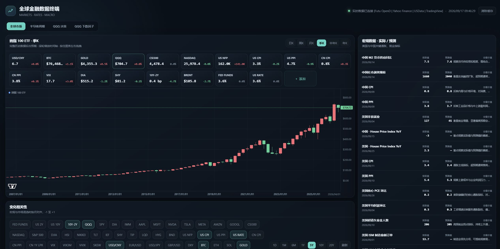
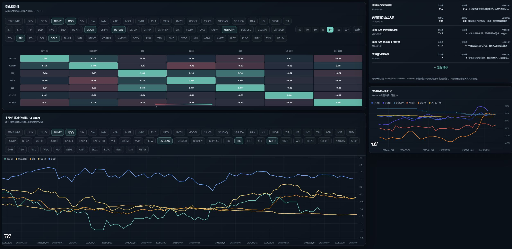
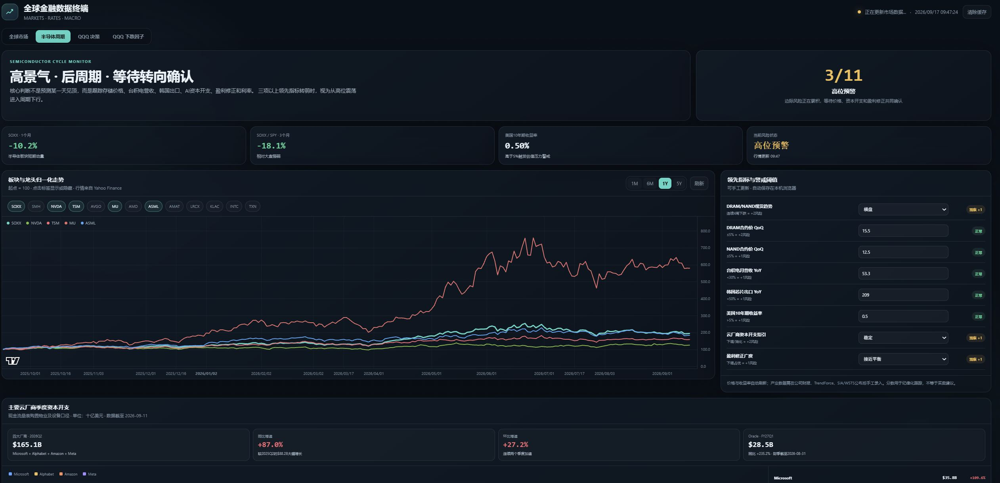
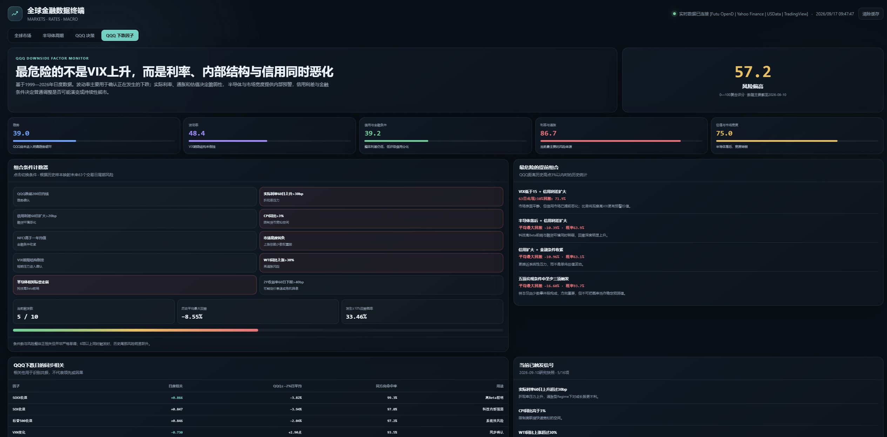

# Global Finance Dashboard

A local financial dashboard for monitoring global markets, macro trends, semiconductor cycles, and QQQ downside risk.

## Screenshots

| Semiconductor Cycle | Macro & Correlation |
|---|---|
|  |  |

| Global Markets | QQQ Downside Factors |
|---|---|
|  |  |

## Run

Requires Python 3.11 or newer and [uv](https://docs.astral.sh/uv/).

```powershell
uv run python dashboard_server.py
```

The dashboard opens automatically at `http://localhost:8765`.
